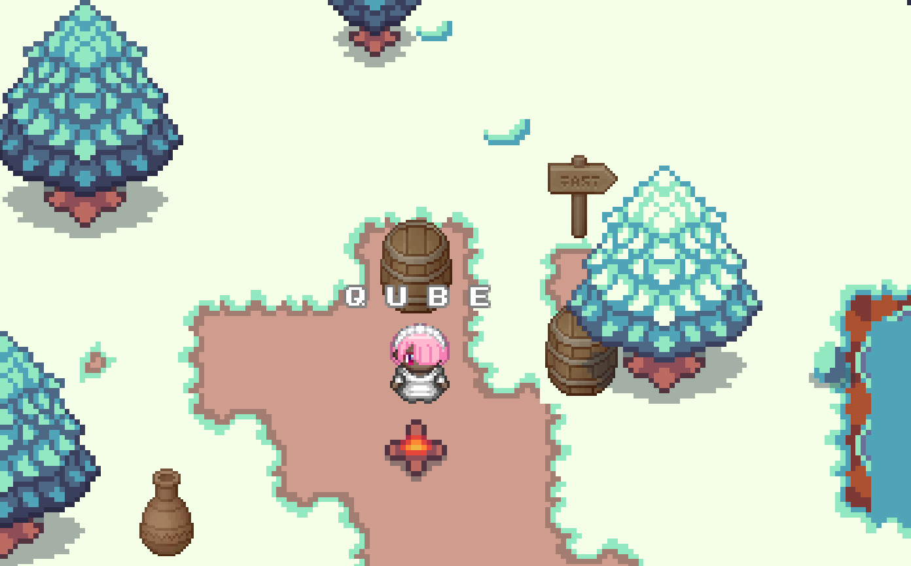

# Christmas Map
A Christmas themed map I made to train myself. You can learn how to make your own at: [https://workadventu.re/map-building](https://workadventu.re/map-building).



## Installation

With npm installed (comes with [node](https://nodejs.org/en/)), run the following commands into a terminal in the root directory of this project:

```shell
npm install
npm run start
```

The project will run at http://localhost:8080/

## Licenses

This project contains multiple licenses:

* [Code license](./LICENSE.code) *(all files except those for other licenses)*
* [Map license](./LICENSE.map) *(`map.json` and the map visual as well)*
* [Assets license](./LICENSE.assets) *(the files inside the `src/assets/` folder)*

### About third party assets

If you add third party assets in your map, do not forget to:
1. Credit the author and license with the "tilesetCopyright" property present in the properties of each tilesets in the `map.json` file
2. Add the license text in LICENSE.assets

### Credits

**Tilesets:** 
* RPG Swow tileset by Franuka: https://franuka.itch.io/rpg-snow-tileset
* RPG Basics by Cainos: https://cainos.itch.io/pixel-art-top-down-basic

**Sounds:** 
* Ambiant sounds (x2): https://www.zapsplat.com/
* Puppy, river and snoring sounds & music: https://orangefreesounds.com/
